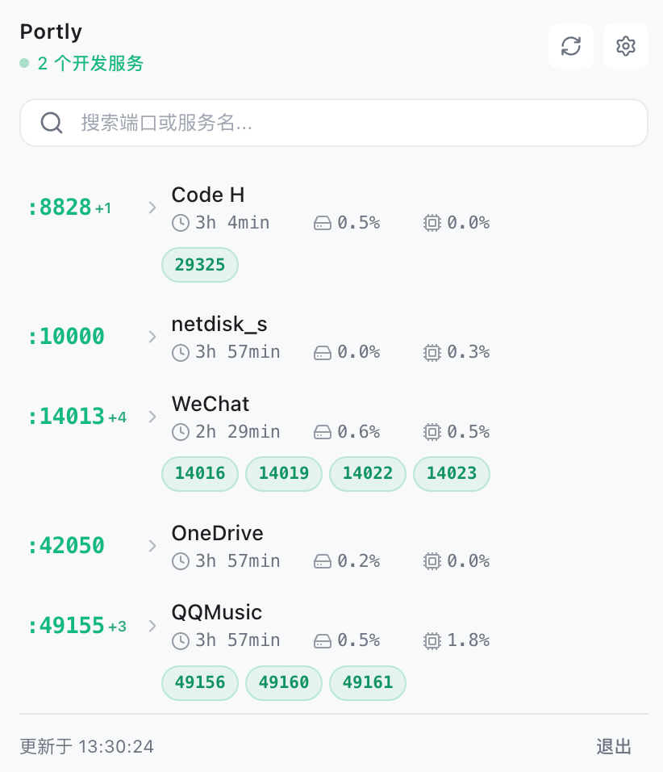

# Portly

Portly 是一个小巧的 macOS 菜单栏应用，用于快速查看本机正在监听的端口，并支持在浏览器、终端中打开对应服务或结束进程。

<p align="center">
  
</p>

## 普通用户安装

在 GitHub Releases 下载最新版：

- Apple Silicon Mac：下载 `Portly-0.1.0-arm64.dmg`

> 当前默认只打包 macOS Apple Silicon 版本。如果需要 Intel Mac 版本，可以单独执行 x64 打包。

安装方式：

1. 双击打开 `.dmg`
2. 将 `Portly.app` 拖到 `Applications`
3. 从应用程序中打开 Portly

如果 macOS 提示“无法验证开发者”或应用来自未知开发者，优先使用系统提供的单应用放行方式：

1. 在 Finder 中打开 `Applications`
2. 右键点击 `Portly.app`
3. 选择“打开”
4. 在弹窗中再次点击“打开”

如果仍无法打开，可进入“系统设置 > 隐私与安全性”，在底部找到 Portly 的拦截提示，点击“仍要打开”。

仍不生效时，再使用终端移除 Portly 自身的 quarantine 属性：

```bash
xattr -dr com.apple.quarantine /Applications/Portly.app
```

不建议执行 `spctl --master-disable`，因为它会开启“任何来源”，影响整台 Mac 的安全策略。

更多排障说明见 [macOS 未知开发者提示处理方式](docs/macos-unknown-developer-workaround.md)。

> 当前构建未做 Apple Developer ID 签名和公证，因此首次打开可能会出现安全提示。

## 开发者从源码运行

```bash
git clone https://github.com/zx123yyds/02_portly.git
cd 02_portly
npm install
npm run build
npm start
```

开发模式：

```bash
npm run dev
```

## 本地打包

生成 macOS `.dmg` 和 `.zip`：

```bash
npm run dist:mac
```

产物会输出到 `release/` 目录。

关于 `.dmg` 体积和 Electron Framework 的说明见 [Portly 安装包体积说明](docs/package-size.md)。
